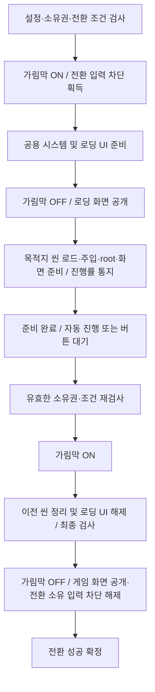

# 씬 전환의 진행률·로딩 화면·진행 대기 설계

2026-10-07. 사용자 요청을 반영한 **설계 초안, 미구현**이다. 로딩 화면은 진행률·게임 팁·자동 진행/버튼 대기를 표현하는 프로젝트 UI다. 사용자가 별도 Unity 씬을 뜻한 것은 아니라고 정정했으므로 실제 로딩 씬 추가·해제는 이번 범위에 포함하지 않는다.

선행 계약은 [GameSceneManager](GAME_SCENE_MANAGER_DRAFT.md), [씬 로더](SCENE_LOADING.md), [씬 준비·해제](ASYNC_SCENE_LIFECYCLE.md), [입력 wrapper 초안](INPUT_SYSTEM_DRAFT.md)이다. 기존 가림막만 사용하는 전환도 유지하고 로딩 화면은 명시적으로 선택한다.

## 기존 구현과 바뀌는 책임

- 현재 구현은 ShowCoverAsync → 공용 root 준비 → 로드/주입/게임 root·화면 준비/이전 씬 정리 → HideCoverAsync 순서다. 진행률 전달과 사용자 진행 대기는 없다.
- 기존 HideCoverAsync는 최종 게임 화면 공개와 전환 소유 입력 차단 해제를 의미한다. 로딩 화면을 보여주려고 중간에 호출하면 gameplay 입력을 풀 수 있으므로 그대로 재사용하지 않는다.
- 가림막은 화면 사이의 전환과 실패 보호를, 로딩 화면은 진행 상황·팁·완료 후 대기를 맡는다. 두 표현의 시점과 성공/실패 결정은 GameSceneManager가 소유하고 실제 UI/애니메이션은 프로젝트 callback이 맡는다.
- 신규 흐름은 GameSceneManager 내부의 명시적 단계로 연결한다. 기존 generic SceneRootFlow 전체를 새 UI 정책으로 바꾸거나 별도 scene manager를 만들지 않는다. 기존 로더·root 준비·조건·취소/해제 소유권을 재사용한다.

## 제안 흐름

위 그림의 이전 씬 정리는 Additive 교체 기준이다. Single은 기존 계약대로 기존 root 종료 후 native Single로 목적지를 로드한다. 이 작업은 로딩 화면 공개 상태에서 진행하며 기존 씬으로 복귀를 보장하지 않는다. 목적지의 Single/Additive 선택을 바꾸거나 Additive를 Single처럼 표시하지 않는다.

- 로딩 화면은 공용 retained Bootstrap 또는 persistent root 아래에 프로젝트가 배치하거나 prefab으로 생성한다. Single에서는 callback·가림막·로딩 UI가 모두 영속 공용 수명 안에 있어야 한다. 추가 정상 씬을 만들지 않으므로 기존 scene inventory/tree 정책을 확대할 필요가 없다.
- 목적지가 native activation을 마쳐도 root 준비, 화면 준비, 사용자 진행 허용은 별개다. 로딩 UI 뒤에서 Awake/Start/Update가 실행될 수 있으므로 프로젝트 gameplay는 최종 manager.CanProceed와 입력 차단을 존중해야 한다. 코어가 모든 게임 스크립트를 정지시키지 않는다.
- 단계 F는 AwaitingProceed이며 manager.CanProceed는 false다. UI 버튼만 진행 신호를 줄 수 있고 전환 성공·새 전환 요청으로 취급하지 않는다. 로딩 화면 공개 중에는 gameplay layer를 계속 차단하고 로딩 UI용 layer만 허용한다.
- 첫 진입/주 씬 교체를 기본 예제로 한다. 파생 씬 추가는 프로젝트가 전체 로딩 화면 사용 여부를 선택할 수 있다. 파생 씬 제거는 기존 가림막·해제 흐름을 유지하며 가짜 씬 로딩 진행률을 만들지 않는다.

## callback 확장 제안

기존 SceneTransitionCallbacks를 확장하고 새 메서드는 기본 no-op/완료 task로 둔다. UI 전용 interface나 두 번째 callback 계층을 추가하지 않는다. 전환별 옵션은 callback의 `UsesLoadingPresentation(context)`에서 선택하고 실행 시작 시 고정한다. 모든 이름과 세부 서명은 구현 전 검토 대상이다.

| callback 제안 | 역할과 완료 의미 |
|---|---|
| 기존 ShowCoverAsync | 가림막 ON·gameplay 차단. 두 번 호출해도 같은 전환 lease를 중복 획득하지 않음 |
| PrepareLoadingPresentationAsync(context, token) | 가림막 아래에서 로딩 UI 생성/참조 연결·레이아웃·필수 팁 데이터 준비 |
| RevealLoadingPresentationAsync(context, token) | 로딩 UI를 표시하고 가림막만 OFF. 전환 입력 차단은 유지 |
| ReportLoadingProgress(snapshot) | 동기 메인 스레드 상태 통지. bar/문구 갱신; 전환 시작이나 자기 완료 await 금지 |
| WaitForProceedAsync(context, token) | 자동 진행은 즉시 완료, 수동 진행은 준비 완료 후 버튼 입력을 await |
| ReleaseLoadingPresentationAsync(context) | 가림막 아래에서 로딩 UI 구독/버튼/자신의 UI 객체·자산 정리. 시작된 정리는 호출자 취소와 무관하게 완료 |
| 기존 HideCoverAsync | 최종 게임 화면 reveal 성공 후 전환 소유 입력 차단 해제 |
| 기존 OnFailure | 실패 표시. 확인 버튼은 전환 성공/가림막 해제를 허용하지 않음 |

context에는 전환 OperationId, 종류·목적지·모드의 immutable 정보만 제공한다. 프로젝트 UI는 native scene handle을 해제하거나 manager가 소유한 root를 종료하지 않는다. callback은 전환 owner보다 오래 살아야 하며 자동 service 검색/생성을 숨기지 않는다.

옵션을 사용하지 않는 기존 callback·BootstrapCallbacks는 현재 호출 순서와 API를 유지한다. **신규 가림막 OFF callback을 기존 HideCoverAsync의 호환 어댑터로 연결하지 않는다.** 별도 기본 로딩 Canvas나 팁 테이블 스키마는 코어에 넣지 않는다.

## 진행률의 의미와 로더 경계

`SceneTransitionProgress`는 OperationId, Stage, 선택적인 StageRatio(0..1), 준비 완료 여부를 가진 immutable snapshot으로 제안한다. 예시 Stage는 PreparingCommon, PreparingLoadingPresentation, ResolvingTarget, LoadingScene, PreparingScene, PreparingPresentation, AwaitingProceed, Finalizing, Completed, Failed다. 기존 SceneTransitionState와 별도 enum을 만들지는 구현 시 실제 구분 필요를 확인하며 기존 직렬화/정수값 호환을 보존한다.

- native 씬 로드: `AsyncOperation.progress`를 보고하고 native 완료 성공을 별도로 확인한다. activation 대기 시 0.9에 정지하는 값을 root 준비 완료로 해석하거나 무조건 0.9로 나누지 않는다. 기존 `allowSceneActivation=true` 동작을 유지하고 버튼 대기에 activation을 보류하지 않는다. [Unity progress](https://docs.unity3d.com/6000.3/Documentation/ScriptReference/AsyncOperation-progress.html)
- Addressables: 주소 해석과 씬 로드를 별도 단계로 보고한다. `PercentComplete`는 내부 작업 진행률이고 바이트 다운로드 비율이 아니다. 다운로드 비율을 제공할 필요가 생기면 `GetDownloadStatus`의 bytes를 별도 지표로 사용한다. 초기 구현에 다운로드/카탈로그 관리 시스템을 추가하지 않는다. [Addressables 진행률](https://docs.unity3d.com/Packages/com.unity.addressables@2.9/api/UnityEngine.ResourceManagement.AsyncOperations.AsyncOperationHandle-1.html)
- root·화면 준비: 현재 PrepareAsync에는 작업량 계약이 없다. 계산할 수 없는 단계는 StageRatio=null로 보고하고 spinner/문구를 표시한다. native 씬 로드 100%만으로 전체 준비 완료를 보고하지 않는다.
- AwaitingProceed는 준비 완료 상태다. 프로젝트는 이때 준비 bar를 100%로 표시할 수 있지만 전환 성공/게임 허용과 구분한다. button 대기 시간은 로딩 진행률에 포함하지 않는다.
- 전체 단일 퍼센트는 프로젝트가 단계별 가중치/표시 정책을 정할 때만 계산한다. 코어가 임의로 0..99%를 증가시키거나 남은 시간을 추정하지 않는다. UI bar smoothing·최소 노출 시간·게임 팁 교체는 프로젝트 연출이며 성공 gate를 대신하지 않는다.

기존 `ISceneLoader.LoadAsync(target, mode)`를 보존하면서 선택적 `ISceneProgressLoader` 경계에 progress를 받는 overload를 추가하는 안을 제안한다. 기존 외부 loader/fake는 그대로 동작하고 진행률 미지원 시 LoadingScene 단계의 ratio=null을 통지한다. 두 native loader는 설치된 UniTask의 `ToUniTask(progress: ...)` 기능을 먼저 재사용한다. observer는 메인 스레드 동기로 호출하고 `System.Progress<T>`의 지연 dispatch로 해제된 UI에 늦게 통지하지 않는다.

관찰자/UI 갱신 예외가 native 로드를 중도 포기하게 만들면 안 된다. manager가 observer 예외를 보관하고 native 결과의 소유권까지 확보한 후 실패·후보 정리로 전환한다. 이미 종료된 OperationId의 통지는 버리고 handle을 화면 쪽으로 넘기지 않는다. ResourceManager 자산 cache에 씬 로드 handle을 공유하지 않는다.

## 자동 진행·버튼 진행·취소

- `WaitForProceedAsync`는 두 방식의 단일 경계다. 기본 구현은 즉시 완료하며, 프로젝트가 팁 최소 표시 시간 또는 버튼 대기를 추가할 수 있다. 버튼은 준비 완료 전 비활성화한다. 미리 누른 입력은 준비 완료 후의 승인으로 저장하지 않는다.
- 수동 대기는 operation별 UniTaskCompletionSource로 구현하는 예제를 제공한다. 버튼 callback은 자기 OperationId의 완료 소스만 한 번 완료하고 `EnterFirstSceneAsync`/`ReplacePrimaryAsync` 등을 재호출하지 않는다.
- 같은 프레임의 submit/click이 준비 화면으로 흘러들어 대기를 즉시 끝내지 않게 UI adapter에서 방지한다. project-only 연출/UI frame 검증으로 확인하며 keyboard/gamepad·pointer를 모두 다룬다.
- manager 작업 수명 token으로 대기를 취소하고 finally에서 버튼 listener를 해제한다. UI 객체 파괴는 성공이 아니라 실행 실패/취소다. 오래된 버튼 이벤트가 다음 전환을 완료시키지 않는다. 대기 중 중복 전환은 기존 규칙대로 거부한다.
- 기존 caller token은 caller의 await만 취소한다. 실제 작업 취소는 `CancelTransition`/owner 종료다. 버튼 대기를 기존 씬 root의 token에 묶어 Single의 원본 씬 종료와 동시에 취소하지 않는다.
- 진행 신호 후 살아 있는 소유권·해제 대상·조건을 기존 종류별 계약에 맞춰 재검사한다. 준비 대기 동안 조건이 바뀌었다면 진행하지 않는다. 종료된 root의 조건을 사후 재평가하지 않는다.

## 실패·정리와 모드별 보장

1. preflight 거부는 기존처럼 무부작용이다. 로딩 UI/가림막 표시 전에 설정과 소유권·조건을 검사한다.
2. 로딩 화면 공개 후 어느 단계든 실패·owner 취소되면 취소되지 않은 token으로 가림막 ON을 먼저 시도한다. 기존 SceneRootFlow는 최종 reveal 중 실패만 cover를 복구하므로 새 경로는 로딩 화면 공개 여부도 추적해야 한다.
3. native 늦은 완료를 확보한 뒤 후보 root/씬을 정리하고, operation의 로딩 UI 구독·생성 객체를 정리한다. 원래 실패와 cover/해제 실패를 함께 보고한다. 오류 UI와 가림막·gameplay 차단은 공용 owner에 남긴다.
4. Additive에서는 대기 중 이전 root를 유지하고 실제 종료는 진행 신호·조건 확인·두 번째 cover 뒤에 수행한다. 현재 LoadAndPrepareAsync의 준비와 이전 subtree release 부분을 분리해야 하며, 기존 가림막-only 경로의 순서는 유지한다.
5. Single은 기존 root 종료가 native 로드보다 먼저 시작되어 rollback을 보장할 수 없다. 마지막 일반 씬 unload 제한·외부 씬 조작 거부·정확한 잔여 씬 진단을 유지한다.
6. UI 객체 파괴/ReleaseLoadingPresentationAsync 실패/최종 reveal 실패를 성공으로 숨기지 않는다. 최종 성공과 manager.CanProceed는 UI 해제와 reveal까지 끝난 뒤에만 공개한다. 가림막 복구 자체의 실패까지 화면 보호를 보장한다고 주장하지 않는다.

입력 wrapper 구현 전에는 기존 프로젝트 소유 차단을 유지할 수 있다. wrapper 연결 시 전환 gameplay 차단 lease는 두 번의 가림막 ON/OFF 전체를 관통하고, 로딩 UI lease는 로딩 화면 공개·대기 동안만 유지한다. 최종 완료는 전환 lease만 해제하고 다른 popup/system modal의 차단은 보존한다.

## 후속 구현 단계 제안

| 단계 | 범위 | 최소 검증 |
|---|---|---|
| 1 진행률 | stage snapshot·선택적 loader progress, 기존 호출 호환 | native/Addressables 보고·미지원 ratio=null, 로드100%와 root 준비 구분, 늦은 통지·observer 예외의 handle 정리 |
| 2 표시 흐름 | 선택적 로딩 UI callback·두 번의 cover·실패 복구 | 기존 순서 보존, UI 준비 전 cover 유지, 로딩 표시 중 gameplay 차단, 중간·최종 reveal/해제 실패 |
| 3 진행 대기 | auto/manual await, 조건 재검사·모드별 정리 시점 | 조기/중복/늦은 버튼, 대기 중 취소/파괴/중복 전환, Additive 이전 root 유지, Single 영속 UI·잔여 씬 |
| 4 통합 예제 | 프로젝트 팁/bar/button UI·입력 연결·최종 UX | 전체 회귀, 원본 사용자 설정 보존, 반복 Play, 두 모드 Player, 실제 keyboard/gamepad/pointer와 최종 사용자 확인 |

현재는 설계 문서 변경뿐이다. 진행률 API·callback·state·UI·입력 wrapper 연결은 미구현이며 Unity 테스트·컴파일·제품 Console·Player는 이번 단위에서 미실행이다. 새 runtime 구현은 사용자 구현 요청과 확정된 단계 범위를 기준으로 TDD부터 시작한다.
